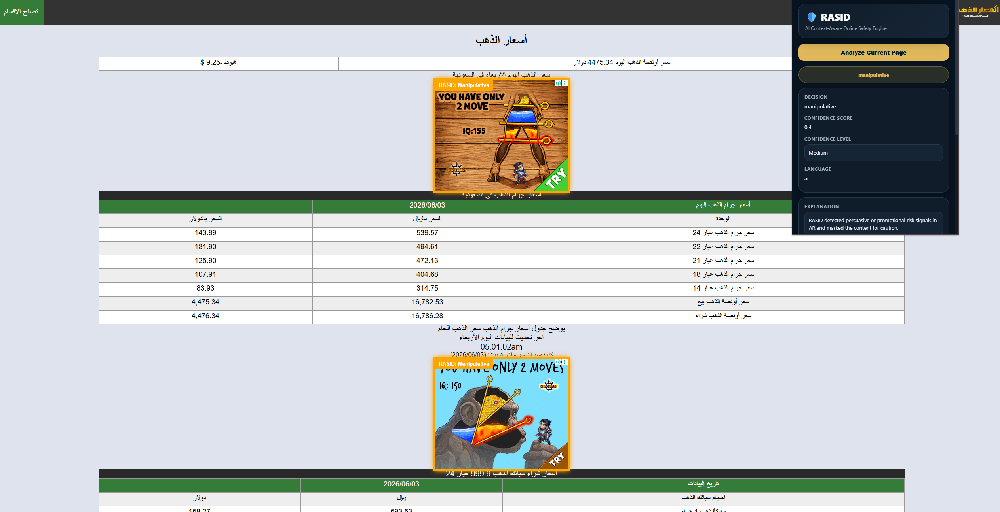
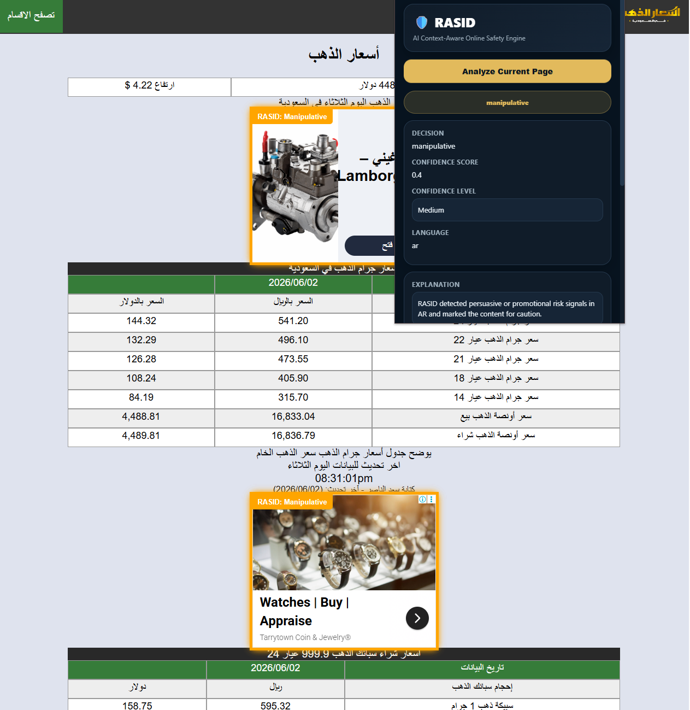
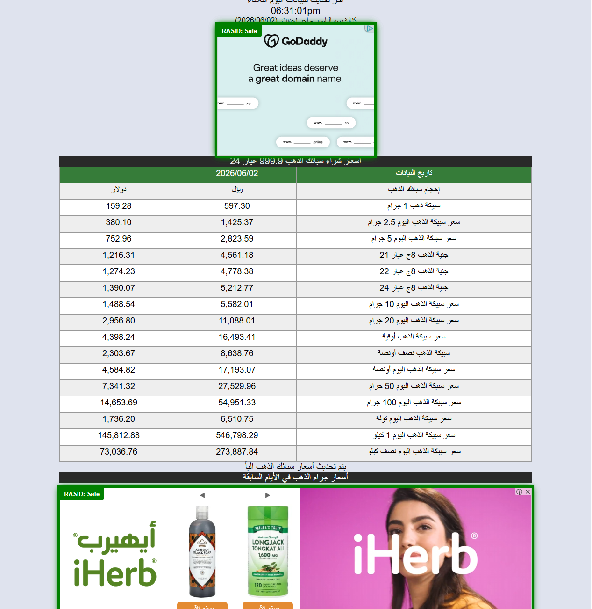
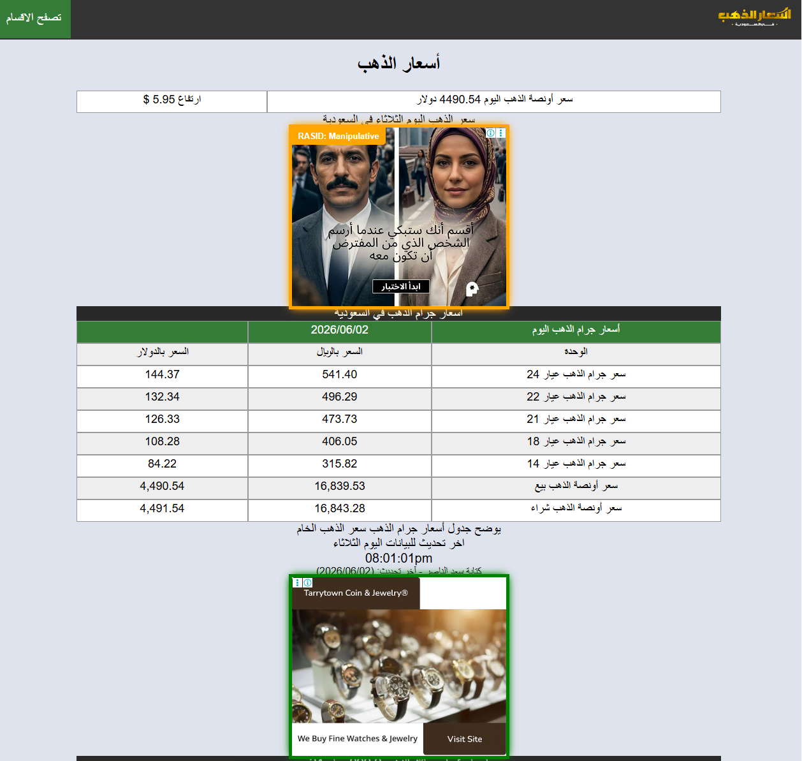

# 🛡️ RASID — AI Context-Aware Online Safety Engine

<p align="center">
  <strong>Multilingual · Multimodal · Explainable AI · Human-in-the-Loop</strong>
</p>

<p align="center">
  An AI-powered online advertising safety system for detecting
  <strong>safe, manipulative, and fraudulent digital advertisements</strong>
  across Arabic and English content.
</p>

<p align="center">
  
  
  
  
  
  
</p>

---

## 📖 About RASID

**RASID** is an AI-powered, context-aware online safety engine designed to analyze digital advertisements and identify potentially unsafe advertising behavior.

Unlike simple keyword filtering, RASID combines **natural language processing, OCR, computer vision, language detection, rule-based analysis, explainable AI, and human moderation** to evaluate advertising content.

RASID supports:

- 🇸🇦 Arabic advertisement analysis
- 🇬🇧 English advertisement analysis
- 📝 Text analysis
- 🖼️ Image and OCR analysis
- 🎥 Video analysis
- 🧠 Transformer-based classification
- 🔍 Explainable AI using LIME
- 🌍 Region-aware policy review
- 👤 Human-in-the-loop moderation
- ⚖️ User dispute resolution
- 🗂️ Auditable analysis history
- 🌐 Browser-based advertisement detection

---

# 🎬 RASID in Action

RASID can analyze advertisements directly on webpages and visually mark detected content according to its classification.

### 🟠 Manipulative Advertisement Detection

Manipulative advertisements are highlighted in **orange**, allowing users to immediately identify content that may contain persuasive, misleading, urgency-based, or emotionally exploitative techniques.



---

### 🔍 Browser Extension Analysis

The RASID browser extension can analyze the current page and display additional information about the detected advertisement.

The analysis panel includes:

- Classification decision
- Confidence score
- Confidence level
- Detected language
- Human-readable explanation



---

### 🟢 Safe Advertisement Detection

Advertisements that do not contain detected harmful or manipulative signals are marked as **Safe** and highlighted in green.



---

### 🌐 Real-World Web Detection

RASID is designed to operate on advertisements embedded within real webpages rather than being limited to manually submitted test samples.

The following example demonstrates safe advertisement detection on an English-language website:


RASID also supports pages containing **multiple advertisements**, allowing individual advertisements to receive independent classifications.



---

# ✨ Core Features

| Feature | Description |
|---|---|
| 🌐 Multilingual Analysis | Supports Arabic and English advertisements |
| 📝 Text Analysis | Detects manipulative and fraudulent language |
| 🖼️ Image Analysis | Extracts text through OCR before AI classification |
| 🎥 Video Analysis | Processes frames, visual text, and speech |
| 🧠 Transformer NLP | Uses AraBERT v2 for Arabic and BERT-base for English |
| 🔍 Explainable AI | LIME highlights features influencing AI decisions |
| 🌍 Regional Policy Review | Supports Saudi Arabia, GCC, EU, US, and general policy contexts |
| 👤 Human Moderation | Moderators can review and challenge AI classifications |
| ⚖️ Dispute Resolution | Users can dispute AI-generated decisions |
| 🗂️ Audit Trail | Predictions and moderation activity are stored for review |
| 🌐 Browser Integration | Detects and labels advertisements directly on webpages |
| 🔌 REST API | FastAPI endpoints allow external applications to access RASID |

---

# 🧠 How RASID Works

RASID uses a multi-stage analysis pipeline rather than relying on a single model.

```text
                         DIGITAL ADVERTISEMENT
                                  │
                                  ▼
                     ┌────────────────────────┐
                     │   Content Extraction   │
                     └───────────┬────────────┘
                                 │
                ┌────────────────┼────────────────┐
                ▼                ▼                ▼
              TEXT             IMAGE            VIDEO
                │                │                │
                │               OCR        Frame Extraction
                │                │           + OCR + Speech
                └────────────────┼────────────────┘
                                 ▼
                       Language Detection
                                 │
                     ┌───────────┴───────────┐
                     ▼                       ▼
                  Arabic                   English
                     │                       │
                 AraBERT v2              BERT-base
                     │                       │
                     └───────────┬───────────┘
                                 ▼
                         Rule-Based Signals
                                 │
                                 ▼
                         Risk Classification
                                 │
                ┌────────────────┼────────────────┐
                ▼                ▼                ▼
              SAFE         MANIPULATIVE       FRAUDULENT
                                 │
                                 ▼
                       LIME Explanation
                                 │
                                 ▼
                         Database Logging
                                 │
                                 ▼
                       Moderator Dashboard
                                 │
                                 ▼
                      Human Review / Dispute
```

This architecture allows RASID to combine automated AI analysis with human oversight.

---

# 🛡️ Risk Classification

RASID classifies advertisements into three primary categories.

| Classification | Meaning |
|---|---|
| 🟢 **Safe** | Normal advertising content with no significant harmful signals detected |
| 🟠 **Manipulative** | Uses potentially exploitative persuasive techniques such as false urgency, emotional pressure, fear tactics, or misleading promotion |
| 🔴 **Fraudulent** | Contains potentially deceptive or scam-like behavior such as phishing, impersonation, fake prizes, or dangerous claims |

---

# 🤖 AI & Technology Stack

### Natural Language Processing

| Language | Model |
|---|---|
| Arabic | AraBERT v2 |
| English | BERT-base |

A custom language router determines which NLP pipeline should process extracted advertisement content.

### Computer Vision & Media Processing

| Task | Technology |
|---|---|
| OCR | pytesseract / EasyOCR |
| Image Processing | Pillow / OpenCV |
| Video Processing | MoviePy / OpenCV |
| Speech Processing | Speech transcription pipeline |
| Deepfake Analysis | Prototype `deepfake_risk` and `deepfake_score` signals |

### Explainability

RASID integrates **LIME (Local Interpretable Model-Agnostic Explanations)** to provide insight into why a model produced a particular classification.

### Backend & Interface

| Layer | Technology |
|---|---|
| API | FastAPI |
| Dashboard | Streamlit |
| Visualization | Plotly |
| Database | SQLite |
| Browser Integration | Browser Extension |
| Data Processing | pandas / NumPy |

---

# 🔍 Explainable AI

AI moderation systems should not operate as unexplained black boxes.

RASID uses **LIME** to identify textual features that contributed to an AI classification.

Example:

```json
{
  "lime_explanation": [
    {
      "word": "NOW",
      "weight": 0.0135
    }
  ]
}
```

These explanations are available through RASID's analysis reports and moderation logs.

This allows moderators to examine **why** a particular advertisement was flagged instead of relying solely on the final classification.

---

# 👤 Human-in-the-Loop Moderation

RASID is designed as a decision-support system rather than a completely autonomous moderation platform.

```text
AI Analysis
     │
     ▼
Initial Classification
     │
     ▼
Moderator Review
     │
     ├──── Accept AI Decision
     │
     └──── Submit Correction
                 │
                 ▼
          Senior Admin Review
                 │
          ┌──────┴──────┐
          ▼             ▼
       Approve        Reject
          │
          ▼
Approved Fine-Tuning Data
```

Moderators can review AI decisions and submit corrections with a written justification.

Corrections are **not automatically used as training data**.

Instead:

1. A moderator reviews an AI decision.
2. The moderator submits a correction and reason.
3. The correction enters a review queue.
4. A senior administrator approves or rejects it.
5. Only approved corrections can be promoted to future fine-tuning data.

This reduces the risk of incorrect or malicious moderator feedback affecting future model behavior.

---

# ⚖️ Dispute Resolution

RASID also supports user-submitted disputes.

Users can challenge an AI classification when they believe an advertisement has been incorrectly categorized.

Moderators can then:

- Review the original advertisement
- Inspect the AI classification
- Review confidence information
- Examine AI reasoning
- Read the user's dispute
- Override the classification when appropriate
- Record the final resolution

All moderation activity is preserved in the audit trail.

---

# 🌍 Regional Policy Review

Advertising requirements vary across jurisdictions.

RASID includes a region policy review layer that allows moderators to evaluate advertisements using different policy contexts.

Supported contexts include:

- 🇸🇦 Saudi Arabia
- 🌍 GCC
- 🇪🇺 European Union
- 🇺🇸 United States
- 🌐 General

This layer complements the AI classification by giving moderators additional policy context during review.

---

# 📊 Moderator Dashboard

RASID includes a Streamlit-based moderation dashboard for inspecting AI activity and managing human review.

| Tab | Purpose |
|---|---|
| 📊 **Overview** | Displays scan statistics, risk distribution, language breakdown, input types, and recent analyses |
| 👤 **Moderator Review** | Review classifications, submit overrides, and record moderation notes |
| 🌍 **Region Policy Check** | Evaluate advertisements using region-specific policy criteria |
| 🗂️ **Logs** | Inspect analysis history, confidence scores, explanations, deepfake signals, and moderator activity |
| ⚠️ **Dispute Requests** | Review and resolve user challenges to AI classifications |

---

# 🔌 REST API

RASID exposes its analysis capabilities through a FastAPI backend.

## Text Analysis

```http
POST /analyze/text/auto
```

Arabic and English are automatically detected.

### Example Input

```json
{
  "text": "Guaranteed profit within 24 hours"
}
```

### Example Response

```json
{
  "classification": "fraudulent",
  "confidence": 0.91,
  "language": "en",
  "reasons": [
    "Detected high-risk promotional claim"
  ]
}
```

---

## Image Analysis

```http
POST /analyze/image
```

Supported formats:

```text
JPG
PNG
WEBP
```

Pipeline:

```text
Image
  ↓
OCR
  ↓
Language Detection
  ↓
Transformer Classification
  ↓
Risk Analysis
  ↓
LIME Explanation
  ↓
Database Storage
```

---

## Video Analysis

```http
POST /analyze/video
```

Supported formats:

```text
MP4
MOV
AVI
```

Pipeline:

```text
Video
  │
  ├── Frame Extraction
  │       ↓
  │      OCR
  │
  ├── Speech Extraction
  │       ↓
  │   Transcription
  │
  └──────────┬──────────
             ↓
       Content Analysis
             ↓
       Risk Aggregation
             ↓
       Classification
```

---

# 🗄️ Database

RASID currently uses SQLite.

```text
logs/rasid.db
```

The database maintains AI decisions and human moderation activity.

| Table | Purpose |
|---|---|
| `analysis_logs` | Predictions, confidence, language, timestamps, explanations, and deepfake signals |
| `moderator_reviews` | Moderator decisions, corrections, notes, and audit history |
| `dispute_requests` | User disputes, AI context, status, and moderator resolution |

---

# 📁 Project Structure

```text
rasid-ai-engine/
│
├── src/
│   ├── rasid/
│   │   └── ...
│   │
│   ├── nlp/
│   │   └── ...
│   │
│   └── vision/
│       └── ...
│
├── data/
├── models/
├── logs/
│   └── rasid.db
│
├── archive/
├── docs/
│   └── images/
│
├── dashboard.py
├── requirements.txt
└── README.md
```

---

# 🚀 Getting Started

## Requirements

### Hardware

| Component | Minimum |
|---|---|
| Processor | Intel Core i5 / AMD Ryzen 5 |
| RAM | 8 GB |
| Storage | 10 GB free |
| GPU | NVIDIA GPU — optional |
| Internet | Required for deployment/API testing |

### Software

| Software | Requirement |
|---|---|
| Python | 3.11+ |
| VS Code | Latest |
| Git | Latest |
| FastAPI | See `requirements.txt` |
| Streamlit | See `requirements.txt` |
| SQLite | Included with Python |

---

# ⚙️ Installation

### 1. Clone the repository

```bash
git clone https://github.com/FMD94/rasid-ai-engine.git
cd rasid-ai-engine
```

### 2. Create a virtual environment

```bash
python -m venv .venv
```

### 3. Activate it

#### Windows

```bash
.venv\Scripts\activate
```

#### macOS / Linux

```bash
source .venv/bin/activate
```

### 4. Install dependencies

```bash
pip install -r requirements.txt
```

---

# 🔐 Environment Configuration

Sensitive configuration such as administrator credentials should **not be committed directly to the repository**.

Create a local `.env` file:

```env
ADMIN_USERNAME=your_admin_username
ADMIN_PASSWORD=your_secure_password
```

Add `.env` to `.gitignore`:

```gitignore
.env
```

For public repositories, an `.env.example` can be provided:

```env
ADMIN_USERNAME=
ADMIN_PASSWORD=
```

---

# ▶️ Running RASID

RASID uses separate API and dashboard services.

## Start the API

```bash
python -m uvicorn src.rasid.api:app --reload
```

Then open:

```text
API:     http://127.0.0.1:8000
Swagger: http://127.0.0.1:8000/docs
```

## Start the Dashboard

Open another terminal:

```bash
streamlit run dashboard.py
```

Then open:

```text
http://localhost:8501
```

## Stop RASID

Press:

```text
CTRL + C
```

in each running terminal.

---

# 📦 Key Dependencies

RASID uses several open-source libraries across its analysis pipeline.

```text
fastapi
streamlit
pandas
numpy
scikit-learn
plotly
pillow
opencv-python
moviepy
pytesseract
python-dotenv
pydantic
```

Additional NLP and explainability dependencies are defined in:

```text
requirements.txt
```

---

# 🛠️ Troubleshooting

### API does not start

Run:

```bash
python -m uvicorn src.rasid.api:app --reload
```

Then inspect the terminal output for the underlying exception.

### Dashboard does not update

Check that:

- The API service is running.
- `logs/rasid.db` exists.
- The application can access SQLite.
- The configured API endpoint is correct.

### Browser extension does not analyze advertisements

Verify:

- Browser permissions are enabled.
- The RASID API is running.
- The API is reachable from the browser.
- Extension configuration points to the correct API address.

### Reset the development database

> ⚠️ This permanently removes locally stored analysis history.

Windows:

```bash
del logs\rasid.db
```

macOS / Linux:

```bash
rm logs/rasid.db
```

Restart RASID afterward to initialize a new database.

---

# 🗺️ Roadmap

Future development areas include:

- [ ] Full deepfake image detection
- [ ] Full deepfake video detection
- [ ] SHAP explainability alongside LIME
- [ ] Real-time browser safety alerts
- [ ] Cloud deployment
- [ ] Multi-user authentication
- [ ] Role-based access control
- [ ] Live social-media advertisement monitoring
- [ ] Advanced multimodal fusion
- [ ] Expanded regional policy support
- [ ] Improved Arabic dialect understanding
- [ ] Continuous model evaluation
- [ ] Moderator-approved model feedback pipeline

---

<h1>🎥 Video Demo</h1>

<p>
See RASID in action — detecting and analyzing digital advertisements
on real webpages, classifying their risk level, and presenting the results
through the RASID browser extension.
</p>

<a href="https://drive.google.com/file/d/1pvjfyim-ZZ5XaJ-VF059tNsGgDWcCtTc/view?usp=sharing">
  
</a>

<p>
  <strong>▶ Click the image above to watch the full RASID demonstration.</strong>
</p>

---

# 🎓 Academic Project

RASID was developed as a Computer Science project at:

**Almaarefa University**  
College of Engineering & Computer Science

**Version:** 2.0 — 2026

**Supervisor:**  
Dr Mohammed Algabri

**Team:**

- Amina Atta
- Faten Aldawood

---

# ⚠️ Disclaimer

RASID is an AI-assisted research and moderation system.

Its classifications should not be interpreted as legal determinations of fraud, regulatory violations, or malicious intent.

AI predictions may contain false positives or false negatives. Human review remains an important part of the RASID moderation workflow.

---

<p align="center">
  <strong>RASID</strong><br>
  AI Context-Aware Online Safety Engine<br><br>
  Building safer and more transparent digital advertising through multilingual, explainable AI.
</p>
